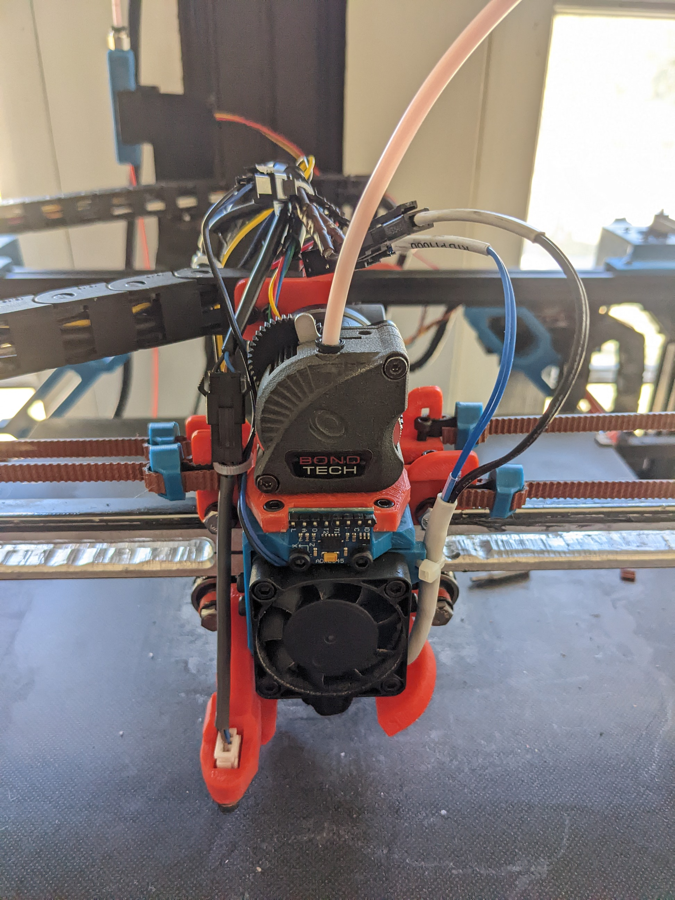

# X5SA Pro EVA 3.0 toolhead mod.
Mod is based on the Heat Insert EVA 3.0 project located at https://main.eva-3d.page/

The insert size EVA is modeled for is M3 x D4.6 x L4.0 but this does not have to be exact, i.e. D5.0 or L5.0 inserts should work as well, just might require a bit of clean up of the plastic that's pushed out.

**30-Oct-2022 Update:** Made CPAP/remote cooling back.  
**21-Oct-2022 Update:** Increased belt adjustment range on (tronxy eva top.stl) and (tronxy eva top.step) files.

# X5SA Pro EVA 3.0 Mod BOM:

9x Heat inserts  
4x m5 x 30mm screws for OSG Rail Bearings  
14x M5 washers for OSG Rail Bearings  
4x m5 nuts for OSG Rail Bearings  
4x m3 x 40mm screws for mounting universal front to the back 35mm will also work, I only had 40mm on hand. 
2x m3 x 18mm screws for mounting 5015 fans  
4x m3 x 12mm screws osg bearing to rail pre tension  
1x m3 x 10mm screw to mount back to fan duct
2x m3 x 10mm screws to mount cable chain  
2x m3 nuts to mount cable chain  
2x M3 x 30mm screws to mount cable chain bracket to the spacer.  
2x m3 x 6mm screws to mount X-endstop  
1x dual fan back  
1x X5SA pro EVA Top ([EVA3/tronxy eva top.stl](https://github.com/ian682/3d-Printing/blob/1bf0406b388527418f87d238a55095cb1d77b1a6/EVA3/tronxy%20eva%20top.stl))  
1x X5SA pro EVA fan duct. Choice depends on hotend length. ([Standard Duct](EVA3/EVA_3-0_X5SA-PRO_Standard_Duct.stl) or [Volcano Duct](EVA3/EVA_3-0_X5SA-PRO_Volcano_Duct.stl))  
2x Duct plugs ([EVA3/Duct Hole Plug.stl](https://github.com/ian682/3d-Printing/blob/1bf0406b388527418f87d238a55095cb1d77b1a6/EVA3/Duct%20Hole%20Plug.stl))  
1x Cable chain spacer ([EVA3/cablechain spacer.stl](https://github.com/ian682/3d-Printing/blob/1bf0406b388527418f87d238a55095cb1d77b1a6/EVA3/cablechain%20spacer.stl))

# Main Eva Parts BOM: 
STLs are grabbable from https://main.eva-3d.page/heat_insert/core/corexy/#bill-of-materials  
EVA moddels will list needed screws and heat insert quantaty along with any other needed items. If you do not see a mount for your hotend or extruder, check on printables and thingiverse. Baring that, a lot of models get posted to the EVA section of the Rat Rig Comunity discord https://discord.gg/FekS7xaR New mounts for extruders and hotends are created most days.

Universal front
Hotend mount of your choice  
extruder/drive mount of your choice  
Probe mount of your choice  
shroud if desiered; extra weight and not needed  

# Other Suggested Mods:
Proper belt tension system, suggested version https://www.thingiverse.com/thing:4605033

# Instructions
1st get all needed washers, screws, nuts, ptfe tubing, etc that you need.  
2nd Print desired STL files.  

Print orientation for X5SA pro Parts  

  

  

Supports will be needed for the X5SA pro EVA top and the bearing arms on the duct. the duct section of the back may or may not need supports depending on how well your printer can bridge.  

After everything is printed, I suggest installing the heat inserts and dry fitting the printed parts together to make sure they all fit and you have everything you need.

Heat insert locations on mod parts:  

  

  

Don't forget the one in the duct:  

  

 
After installing all the heat inserts in the mod parts and the original EVA parts, assuming you have done a drie fit, you are ready to take apart the old tool head and install the new one. You will need the OSG bearing wheels from the old printhead plate, thats the wheels that ride on the rail. I chose to install connectors for the fans, hotend, and ABL sensor. It makes changes and installs much easier.  

Start with installing the OSG bearings in the top and duct bottom. The doct bottom is the easiest of the two to do, so you may want to start with that. Each bearing will get one or two washers, depending on thickness, that go against it on the side that that indents. One side of the bearing protrudes and the other is indented. the washer needs to fit a little loose inside that part of the bearing or it may cause friction. I chose to face the protruding side of the bearings facing the front. It doesn't matter if it faces the front or back, but all 4 must face the same direction.

Top with bearing parts:

  

   

In this case, all 4 of the bearing required two washers to fill up the space for the bearings. Remember, the washers go on the side that doesn't protrude. For the m5 x 30mm screws, you will need to put a washer on the screw before you start installing it or it will stick out just a little to far. So the order is, washer onto m5 screw > insert screw into top or bottom > insert bearing and start putting the screw through it > two washers > out the other side of the bearing holder arms > nut. The bottom duct will also get another washer just before the nut, but the top does not get that washer. You can tighten the screws on the bottom duct bearings, but leave the ones for the top bearings loose so they can tension on the rail later.

  
  
  

 

After this is done, you can build out the Universal front for the print head.

  
  
  
  
  
  
  
  

  

At this point you are ready to start installing. There are two changes need so that you don't run into anything at the back of the printer. 1st, install the spacer to push the cable chain holder further back. This gets 2 heat inserts at the back of it and uses two 20mm m3 screws and washers to attach the metal plate to it. You then re-use the m4 screws and t-nuts to insall the spacer on the rail again. 2nd, the stock X5SA cable breakout box need moved so it attaches to the bottom of the back rail instead of the top.

  
  

  

Next you can mount the cable chain to the back plate of the EVA mod. Two m3 x 10mm screw are used for this along with washers and nuts.

  

 

Now install the 4x m3 x 40mm scews through the back plate.

  

 

And slide on the bottom duct. Don't miss installing the m3 x 10mm screw from the back into the duct.

  

 

Move the printhead so that the OSG rail bearings on the duct mate to the bottom of the rail and install the X5SA EVA top onto the m3 x 40mm screws.

  

 

Now you can install the universal front onto the printhead. The front mates to the top, bottom, and back with the m3 x 40mm.  
Install the belts, and then the four m3 x 12mm screws to tension the OSG bearing on the rail. Tighten the 12mm screws down untill the bearing screws bottom out in the there slots. At this point you can tighten the bearing screws down. Adjust the belts up or down to align with the pulleys on either side.

  

 

Install the X-endstop.

  

 

Mount the Part cooling fans.

  

 

Install the plugs in the holes in the back ducts

  

 

After that, install the extruder of your choice, cleanup the wiring, and tune the printer. I would also encurage installing a means to accuratly tune the belt tension, such as the one at the top of this page. I suggest using Andrew Ellis' [tuning guide](https://github.com/AndrewEllis93/Print-Tuning-Guide).

Congratulations, you are now running the EVA 3 printhead on your TronXY X5SA Pro

  

 

